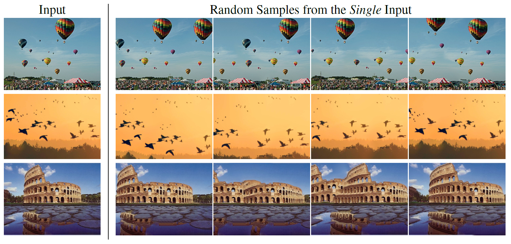

# GPNN

### Pytorch implementation of the paper: "[Drop the GAN: In Defense of Patches Nearest Neighbors as Single Image Generative Models](https://arxiv.org/pdf/2103.15545v1.pdf)"

## Random Sample from a Single Image
With GPNN, you can generate a random sample from a given image in few seconds. For example:



## GPNN's Other Applications
GPNN can perform many other tasks, such as image generation, conditional inpainting, structural analogies, image retargeting, collage, and more. Currently, this implementation supports only the first three tasks. 
  
 
## Code
### Install Dependencies
```
python -m pip install -r requirements.txt
```
This code will run on cuda gpu if available.
Running on cpu is by specifying '--not_cuda'.

### Memory and Speed
If running this code on your machine is too exhausting, or you want to get quick results, you may:
- Generate smaller image by specifying '--out_size \<int\>'
- Use very fast approximate-nearest-neighbor method ([faiss](https://github.com/facebookresearch/faiss/blob/master/INSTALL.md)), by specifying '--faiss'. Install faiss by the following:
```
python -m pip install faiss-gpu
```
> Notice that this method is different from the normalized distance matrix presented in the original paper.

###  Random Sample
To generate a random sample, run: 
```
python random_sample.py -in <image_path>
```
You may control the variation degree of the new sample by adjusting the noise level '--sigma'. Default is 0.75.

###  Structural Analogies
To generate a new image where the content of one image is constructed into the structure of another image, run:
```
python structural_analogies.py -a <first_image_path> -b <second_image_path>
```
where the first image is the content and the second is the structure.

### Inpainting
To generate color-guided inpainting recovery, use an inpainted image where the inpainted area color is similar to your target recovery color (in the same image):
```
python inpainting.py -in <image_path> -m <mask_path>
```
the mask is in the following format - ones in the pixels where the inpainted area is, and zeros elsewhere. 


> Generated images will be saved in './output' folder. To change that, specify '-out <dir_path>'.

> In each of the tasks, there are many parameters to adjust. A full list may be obtained by specifying '--help'. 


###### This repository borrows the images database from the SinGAN repository.